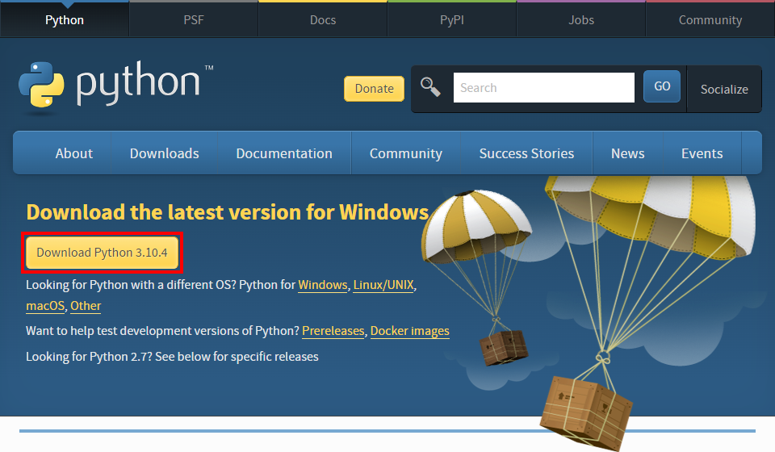
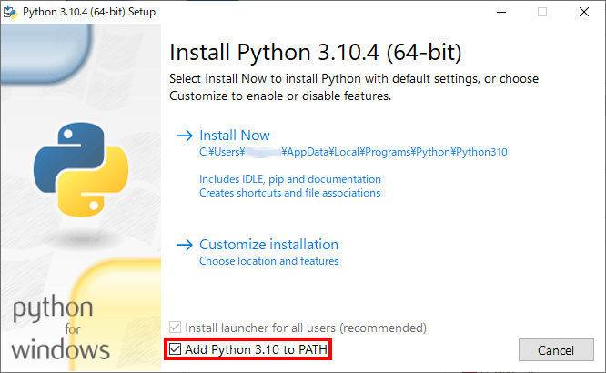
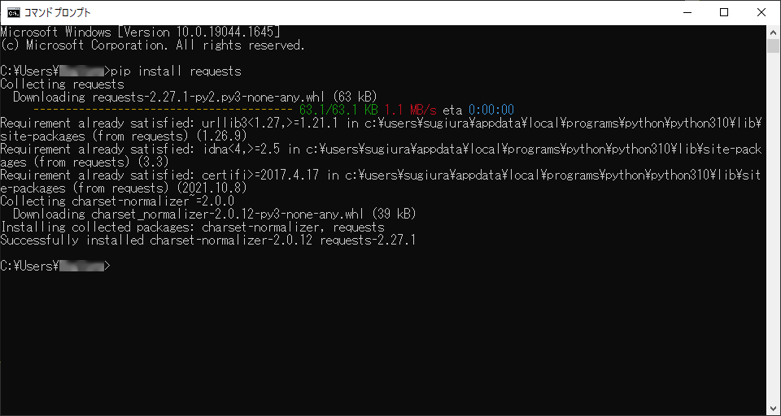
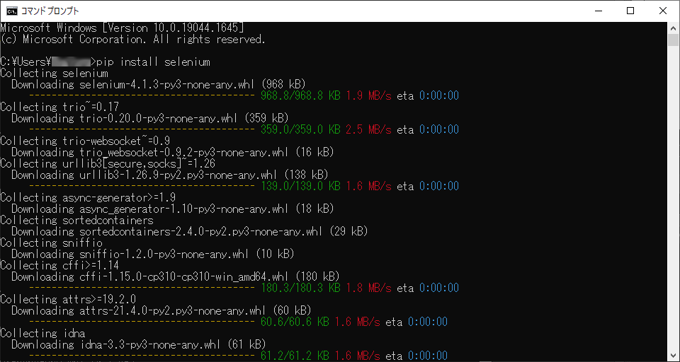

# scrape_teacup_bbs

teacup. 掲示板ログ保存プログラム

## 目次

 - [このプログラムについて](#このプログラムについて)
 - [ファイル構成](#ファイル構成)
 - [動作環境](#動作環境)
 - [プログラムのダウンロード](#プログラムのダウンロード)
 - [動作環境構築方法](#動作環境構築方法)
 - [プログラムの実行方法](#プログラムの実行方法)
 - [プログラムの実行時オプション](#プログラムの実行時オプション)
 - [トラブルシューティング](#トラブルシューティング)
 - [本プログラムのライセンスについて](#本プログラムのライセンスについて)
 - [注意事項](#注意事項)

## このプログラムについて

GMO が提供する teacup.掲示板は 2022年8月1日 13:00 にサービスを終了する予定になっていることから、  
teacup. 掲示板の内容をスクレイピングして保存するために作成したプログラムです。

 - ログファイル形式は HTML
 - 投稿文書および投稿画像をすべて保存（音楽・動画ファイルは未対応）
 - 元記事へのリンクに対応
 - ログ１ページ分に記録する投稿数を調整可能
 - 掲示板の説明書き（掲示板タイトルの直下に表示される内容）の差し替え可能

## ファイル構成

 - scrape_teacup_bbs.py …… プログラム本体
 - readme.MD …… いま読んでいるファイルです
 - img …… readme.MD で使用する画像ファイル群

## 動作環境

 - Google Chrome
 - Python （3.x 系が必要、2.x 系は不可）
 - Selenium

上記ツール群がインストールされている環境であれば OS を選ばず動作します。  
（Windows 10 Pro 64bit および Ubuntu Desktop 20.04 LTS で動作確認済み。未確認ですが mac OS でも動作するはず）

## プログラムのダウンロード

Windows のご利用の方は、下のリンクを右クリックして「名前を付けてリンクを保存」を実行してください。

https://raw.githubusercontent.com/suwasakix/scrape_teacup_bbs/main/scrape_teacup_bbs.py


## 動作環境構築方法

最も利用シーンが多いであろう Windows のみ説明します。  
（Ubuntu が使える人は PC スキルの高い人ばかりだと思うので、各自でがんばってー）

■ Python のインストール

こちらから最新の Python のインストーラをダウンロードしてください。  
https://www.python.org/downloads/

「Download Python 3.x.x」のボタンを押すとダウンロードが始まります。  
（バージョンの数字はそのときの最新が表示されます）



Python のインストーラを起動すると、次のような画面が表示されます。

「Install Now」を選択するとインストールが開始されますが、その前に  
**必ず「Add Python 3.x to PATH」のチェックを入れてください**。  
（チェックを入れないと、インストール後に環境変数の設定が必要になり面倒です）



画面に「Setup was successful」と表示されたらインストール完了です。

■ Python パッケージ（requests および selenium）のインストール

Windows のスタートメニューから「Windows システム ツール」→「コマンド プロンプト」を実行します。  
コマンド プロンプトを起動したら、以下の２つのコマンドを実行してください。

「**pip install requests**」



「**pip install selenium**」



コマンドの実行が終わったらコマンド プロンプトのウィンドウを閉じて大丈夫です。

■ Google Chrome のインストール

特に説明の必要もないと思います。まだの方はこちらから↓  
https://www.google.com/intl/ja_jp/chrome/

■ Google Chrome のバージョン確認

Google Chrome のバージョンは、メニューから「ヘルプ」＋「Google Chrome について」を選択するか、  
URL に「chrome://settings/help」と入力することで確認できます。  
（この原稿を書いている時点での最新バージョンは 101.0.4951.41 です）

■ Selenium WebDriver のインストール

WebDriver はこちらのサイトにあるので、各自のブラウザ環境に合ったものをダウンロードします。  
https://www.selenium.dev/ja/documentation/webdriver/getting_started/install_drivers/

Google Chrome 用の WebDriver はこちらにあります。  
**必ずお使いの Google Chrome のバージョンと一致するものを選んでください**。  
https://chromedriver.storage.googleapis.com/index.html

Windows 用の WebDriver のダウンロードファイル名は chromedriver_win32.zip です。  
（64bit 版の Windows でも使えます）

chromedriver_win32.zip を解凍すると chromedriver.exe というファイルがあるので、それを Windows のパスが通ったフォルダ  
（例えば、C:\\Users\\<ユーザー名>\\AppData\\Local\\Microsoft\\WindowsApps）に置いてください。  
本プログラム (scrape_teacup_bbs.py) と同じフォルダに置いても問題ありません。

## プログラムの実行方法

 - Windows の方はコマンドプロンプトで、本プログラムが存在するフォルダから以下のコマンドを実行してください。

```
python scrape_teacup_bbs.py <teacup.掲示板のURL>
```

 - max OS や Ubuntu の方はターミナルで、本プログラムが存在するフォルダから以下のコマンドを実行してください。

```
python3 scrape_teacup_bbs.py <teacup.掲示板のURL>
```

<teacup. 掲示板のURL> の部分には、「`https://XXXX.teacup.com/YYYYYYYY/bbs`」という書式の文字列が入ります。  
（XXXX および YYYYYYYY の箇所は、保存する BBS のものに置き換えてください）

「All done.」と表示されたらログ保存はすべて完了です。  
ログファイルは、bbs01.html, bbs02.html, …… というように連番で保存されます。  
ファイル名の連番の桁数は、ファイルの数によって適宜調整されます。

なお、掲示板の投稿件数やインターネットの回線状況によって、ログがすべて保存されるまで数時間かかる場合がございます。  
そのような場合にはどうか気長にお待ちください。

## プログラムの実行時オプション

各オプションは組み合わせて指定することが可能です。

 - -B (--background)  
Google Chrome の画面を起動することなく処理を行います。
```
python3 scrape_teacup_bbs.py <teacup.掲示板のURL> -B
```

 - -P (--pages)  
最新の数ページのみログ保存を行います。「-P」の後ろに保存するページ数を指定してください。  
このプログラムをちょっと試してみたい場合にどうぞ。  
\-P オプションを指定しない場合には、すべてのページをログに保存します。
```
python3 scrape_teacup_bbs.py <teacup.掲示板のURL> -P <ログ保存する掲示板のページ数>
```

 - -N (--posts-per-page)  
ログ１ページ（１ファイル）当たりに保存する投稿件数を設定します。「-N」の後ろに投稿件数を指定してください。  
元記事へのリンク先も、ページの割り付けに応じて自動的に調整されます。  
\-N オプションを指定しない場合は、１ページ当たりの投稿件数は保存元の掲示板と同じになります。
```
python3 scrape_teacup_bbs.py <teacup.掲示板のURL> -N <１ページ当たりのログ保存件数>
```

 - -T (--bbs-title)  
掲示板のタイトルを変更して保存できます。
```
python3 scrape_teacup_bbs.py <teacup.掲示板のURL> -T <掲示板のタイトル>
```

 - -I (--bbs-info-file)  
掲示板の説明書きの内容を差し替えて保存できます。  
差し替える内容を別途テキストファイルとして用意し、そのファイル名を「-I」の後ろに指定してください。
```
python3 scrape_teacup_bbs.py <teacup.掲示板のURL> -I <掲示板の説明書きを記したテキストファイルの名前>
```

（詳しい説明）

掲示板のソースファイルを表示すると、100行目～200行目のあたりに次のような構文が存在するはずです。

```
<DIV ID="header"><!-- header START -->
  <DIV class="bbstitle_margin">  <h1><a href="/YYYYYYYY/bbs"> 掲示板のタイトル </a></h1>
  <P> 掲示板の説明書き </P>
  </DIV>

    :
    (略)
    :
</DIV><!-- header END -->
```

< DIV class="bbstitle_margin" > のブロックの中にある < h1 > ～ < /h1 > の内容が掲示板のタイトルに、  
< P > ～ < /P > の内容がタイトルの直下に表示される説明書きに対応します。  
本プログラムの「-T」オプションで掲示板のタイトルを、「-I」オプションで掲示板の説明書きを  
それぞれ差し替えることができます。  

掲示板の説明書きは HTML 形式で記述することもできるため、表示する画像ファイルを差し替えると  
いったことも可能です。

## トラブルシューティング

- プログラム実行中に "cannot get image file (画像ファイルのURL)" という警告メッセージが出る  
お使いのインターネット回線の状況によっては、画像ファイルのダウンロードに失敗する場合があるようです。  
ダウンロードに失敗した画像ファイルについては、別途ダウンロードして取得するようにしてください。

## 本プログラムのライセンスについて

本プログラムのライセンスは MIT ライセンスです。

 - 本プログラムの著作権は作者 (suwasakix) が保持します。本プログラムの頒布には著作権表示を必要とします。
 - 本プログラムは無償であり、作者の許可を得ることなく誰でも自由に無制限で利用可能です。改変することも一切自由です。
 - 本プログラムは無保証です。作者は、ソフトウェアの利用によって生じた結果に何らその責任を負いません。

## 注意事項

本プログラムのご利用にあたっては、著作権法を遵守してください。  
投稿に関するライセンス規定が掲示板に存在する場合には、その規定内容に沿ったご利用をお願いいたします。  

これらの説明の意味が分からない方は、本プログラムによって保存したログファイルは個人目的の利用にのみ留めてください。

